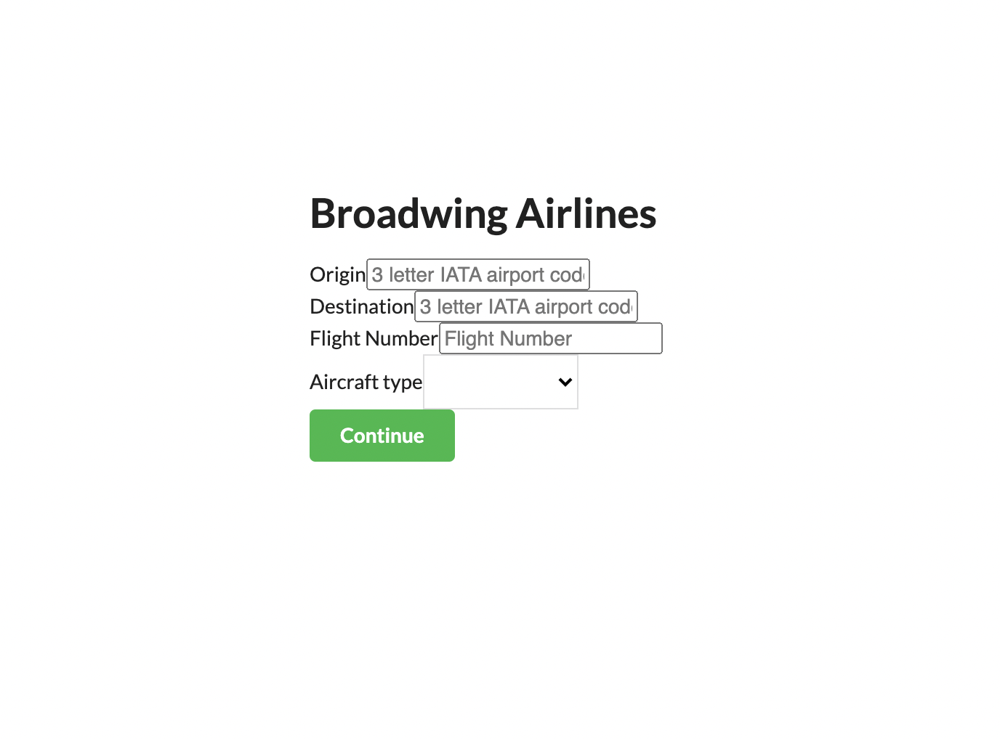
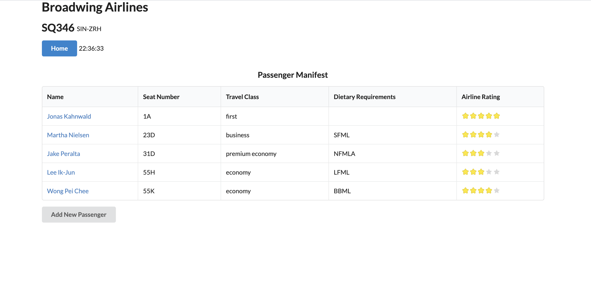
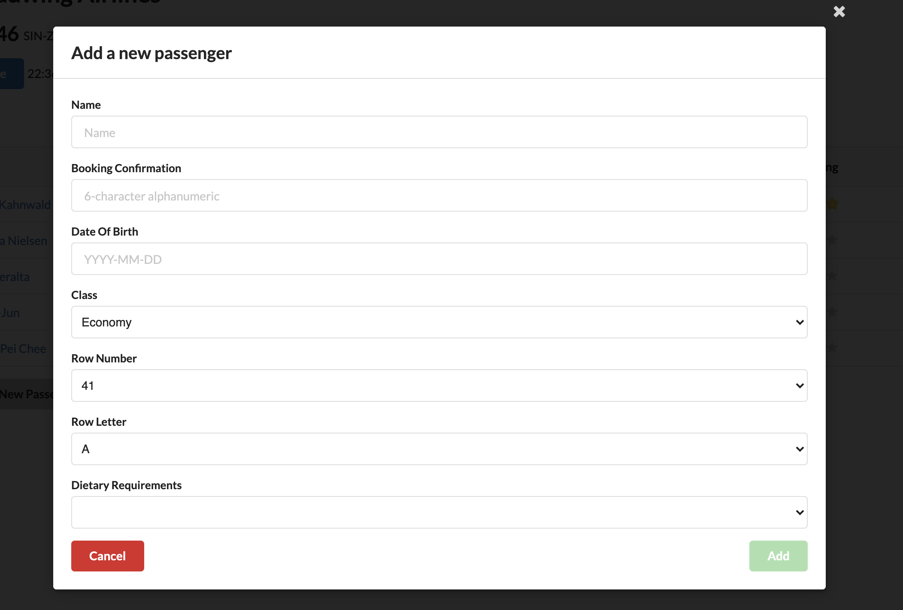
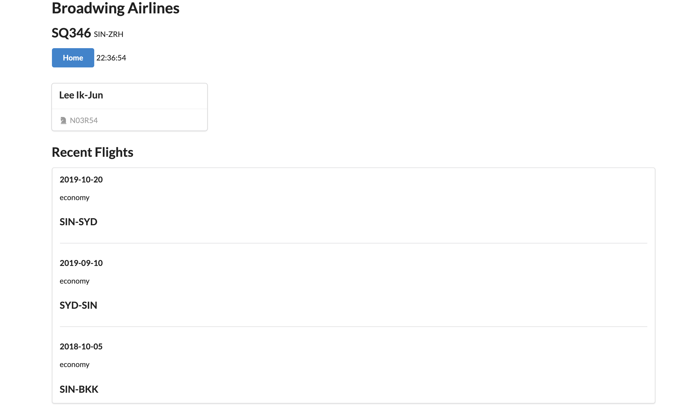

# Passenger Manifest

This is the frontend repository of the Passenger Manifest webapp. The backend repo can be found [here](https://github.com/fairyinabottle4/manifest-backend). The webapp can be found at

* Passenger Manifest is a webapp for airline crew to manage the passengers they have on board. 
* Crew will first have to enter details about the route, flight number and aircraft type.
* The manifest of passengers will then be displayed on the home page. Details that will be displayed include
  * Name
  * Seat Number
  * Travel Class
  * Dietary Requirements
  * Rating of past experiences with airline
* Upon clicking the name of the individual passenger, crew will be able to see the following
  * Booking confirmation number
  * Frequent Flyer status
  * Recent flights made with the airline
* Crew can also manually add passengers to the manifest by adding the 'Add Passenger' button on the home page. 

## Future Improvements

* Store info in database and pull passenger info from database where applicable. 
* Differentiate seats and travel class by aircraft type. 

## Some screenshots

Details Entry Page
 
 
 

 
 
 
Home page (Passenger Manifest)
 
 
 

 
 
 
Add Passenger Modal
 
 
 

 
 
 
Passenger details
 
 
 

